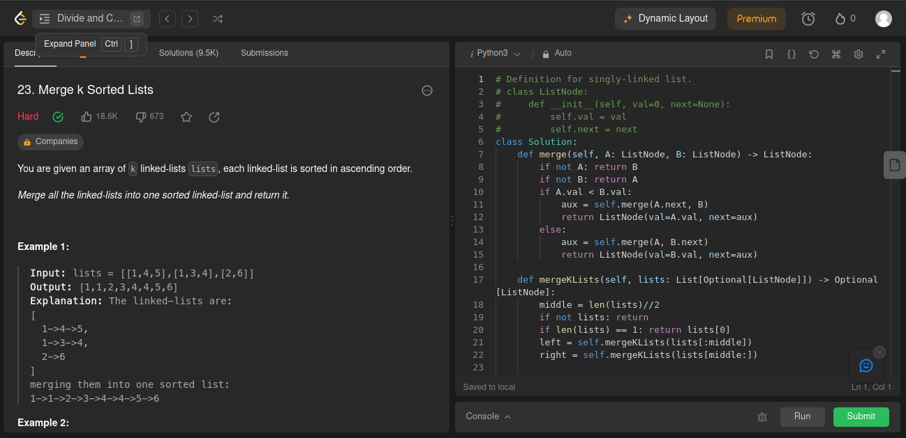
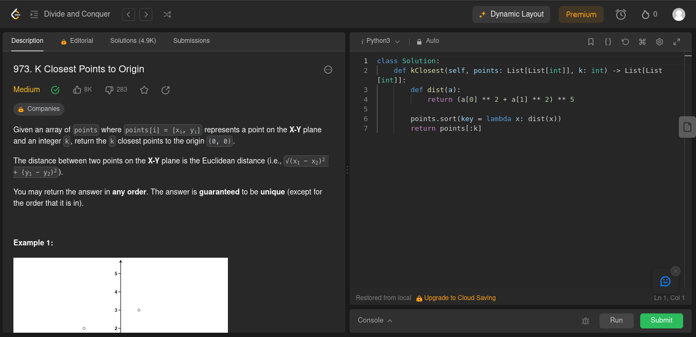
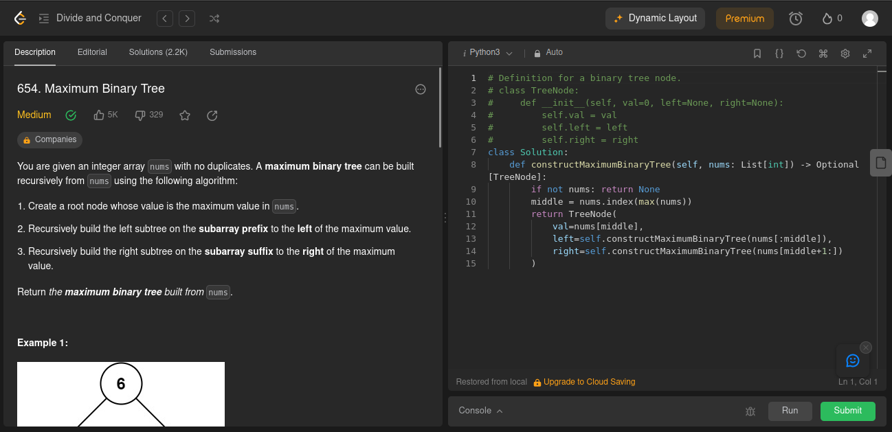
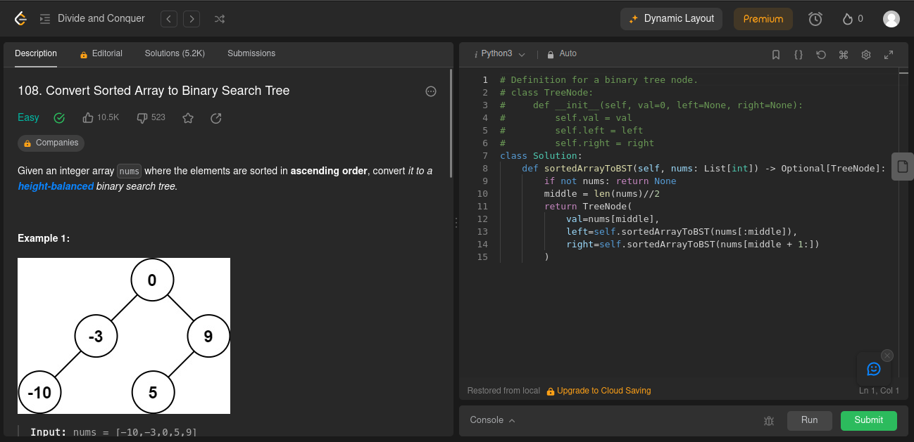
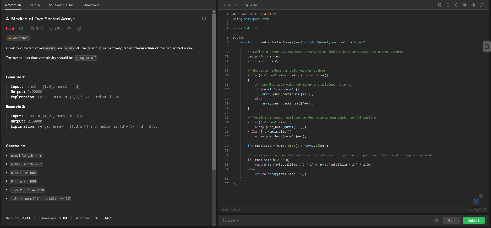
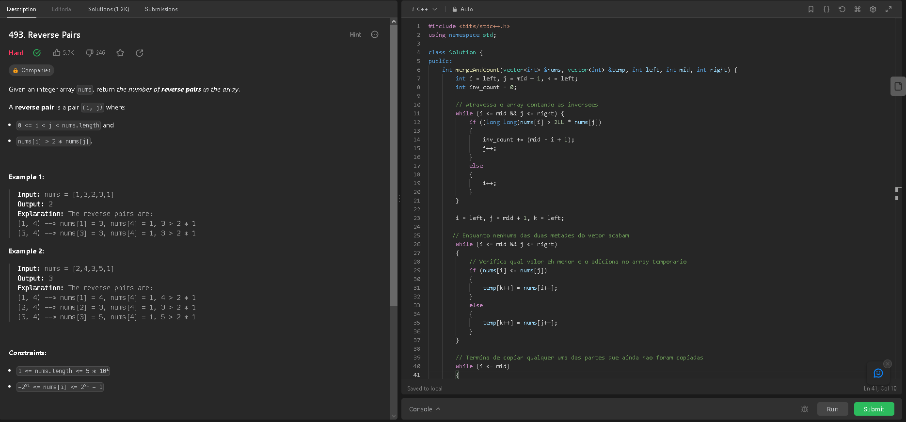
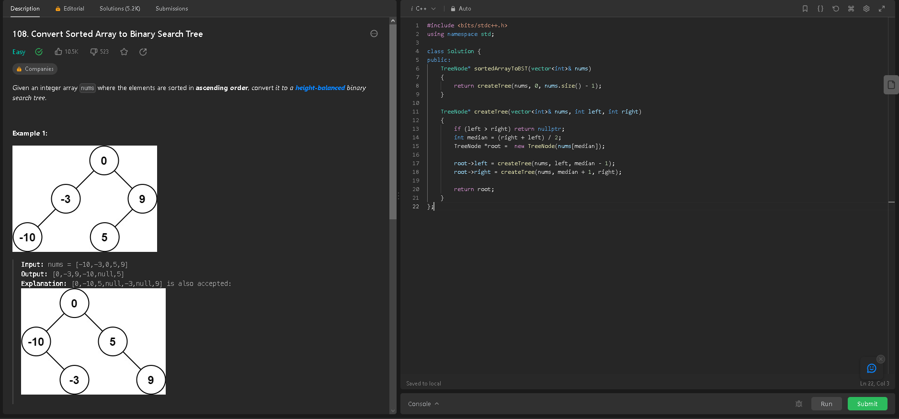

# D&C_OnlineJudgeContests

**Conteúdo da Disciplina**: Dividir e Conquistar 

## Alunos
| Matrícula | Aluno |
| -- | -- |
| 21/1029620 | Douglas Alves dos Santos |
| 21/1039297 | Bruno Martins Valério Bomfim |

## Sobre 
Este repositório apresenta a solução de exercícios de juíz online do site LeetCode relacionados ao assunto de dividir e conquistar. Foram resolvidos um total de 7 exercícios, conforme a tabela abaixo:

| Exercicio | Dificuldade  | Aluno que Resolveu |
| -- | -- | -- | 
| [Merge k Sorted Lists](#merge-k-sorted-lists-difícil) | Difícil | Bruno Martins Valério Bomfim |
| [k Closest Points to the Origin](#k-closest-points-to-the-origin-médio) | Médio | Bruno Martins Valério Bomfim |
| [Maximum Binary Tree](#maximum-binary-tree-médio) | Médio | Bruno Martins Valério Bomfim |
| [Convert Sorted Array to Binary Search Tree (Python)](#convert-sorted-array-to-binary-search-tree-python-fácil) | Fácil | Bruno Martins Valério Bomfim |
| [Median of Two Sorted Arrays](#median-of-two-sorted-arrays-difícil) | Difícil | Douglas Alves dos Santos  |
| [Reverse Pairs](#reverse-pairs-difícil) | Difícil | Douglas Alves dos Santos  |
| [Convert Sorted Array to Binary Search Tree (C++)](#convert-sorted-array-to-binary-search-tree-c-fácil) | Fácil | Douglas Alves dos Santos  |

## Screenshots

### [Merge k Sorted Lists](https://leetcode.com/problems/merge-k-sorted-lists/) (Difícil)

[Código](./exercicios/mergeKSortedLists.py)

### [k Closest Points to the Origin](https://leetcode.com/problems/k-closest-points-to-origin/) (Médio)

[Código](./exercicios/kClosestPointsToOrigin.py)

### [Maximum Binary Tree](https://leetcode.com/problems/k-closest-points-to-origin/) (Médio)

[Código](./exercicios/maximumBinaryTree.py)

### [Convert Sorted Array to Binary Search Tree (Python)](https://leetcode.com/problems/convert-sorted-array-to-binary-search-tree/) (Fácil)

[Código](./exercicios/convertSortedArrayToBinarySearchTree.py)

### [Median of Two Sorted Arrays](https://leetcode.com/problems/median-of-two-sorted-arrays/) (Difícil)

Esse exercício envolve o uso do algoritmo de merge para encontrar a mediana da junção de dois arrays ordenados.
[Código](./exercicios/findMedianSortedArrays.cpp)

### [Reverse Pairs](https://leetcode.com/problems/reverse-pairs/) (Difícil)

Esse exercício envolve o uso do algoritmo de contagem de inversões usando o merge para contar o número de inversões em um array.
[Código](./exercicios/reversePairs.cpp)

### [Convert Sorted Array to Binary Search Tree (C++)](https://leetcode.com/problems/convert-sorted-array-to-binary-search-tree/) (Fácil)

Esse exercício envolve o uso de recursão para converter um array ordenado em uma árvore binária de busca.
[Código](./exercicios/sortedArrayToBST.cpp)

## Instalação/Uso
**Linguagem**: Python e C++ 
Caso queira testar o código dos exercícios, não é preciso instalar nada, somente copie o código presente na pasta "exercicios" e cole na respectiva página no LeetCode e de submit.

## Apresentação
Foi gravado um vídeo explicando a solução de cada um dos exercícios, segue o [link]()

OBS.: O vídeo está com a extensão .mp4 e deve ser baixado para que possa ser assistido.

